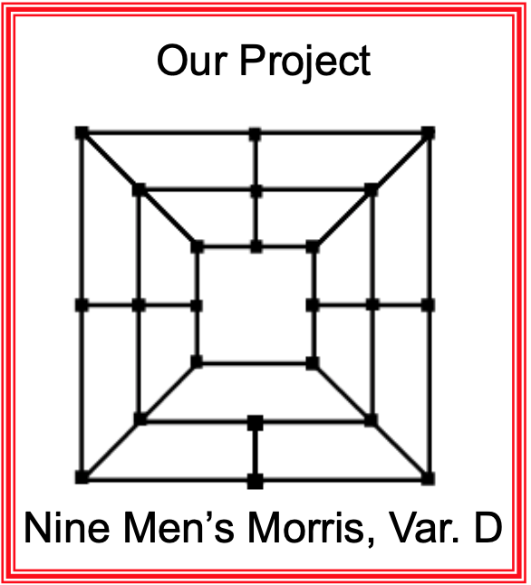

# This set of programs are design to make one move of the Nine Men's Morris Game.
### Also, it is a class project for Artificial Intelligence. This project follows Variant-D version of the game.

 </br>
#### Setup:
- black vs. white
- 9 pieces per side
- Can only place on line intersections, yielding 23 spaces
#### Strategy:
- Game play is like a cross between Tic Tac Toe and Checkers
- Goal is to capture your opponent’s pieces by getting three pieces in a row (called a “mill”)
  - mill: At any stage if you get three pieces in a row along the same straight board line, then you may remove one isolated opponent’s piece from play. An isolated piece is a piece that is not part of a mill.
- The winner is the first player to reduce the opponent to only 2 tokens, or blocks the opponent from any further moves
- There are three phases of play
#### Rules:
- Open Phase:
  - Players take turns placing pieces on any vacant board intersection spot until all pieces have been placed 
- Midgame
  - Once all the pieces are placed, then take turns moving one piece along a board line to any adjacent vacant spot
- Endgame
  - When a player is down to only three game pieces, then they may move a piece to any open spot, not just an adjacent one (“hopping”)
  
#### Parameters:
- given: current board position, and depth to search for best move
- output: board position with move applied
#### Implementation:
- Using n-depth look ahead to find best possible move
- Applying Alpha-Beta pruning to reduce worse moves from search
- Developing heuristic evaluation increase performance
#### Programs:
- Language: Python 
- Helper classes:
  - Player.py
  - Board.py
  - Position.py
- Move Generators:
  - ABOpeningImproved.py: generate an opening move
  - ABGameImproved.py: generate a mid/end game move

#### Example moves:
- Opening move:
```
Input board: xBxBWxWBxxxxxxxBxWxxxxW
x-----x-----W
|\    |    /|
| W---x---x |
| |\  |  /| |
| | x-B-x | |
| | |   | | |
x-x-x   x-x-x
| | |   | | |
| | W---B | |
| |/     \| |
| B---W---x |
|/    |    \|
x-----B-----x
======================== end turn ============================
Output board: xBxBWxWBxxxxWxxBxWxxxxW
Positions evaluated by static estimation: 35871
MINIMAX estimate: 132
x-----x-----W
|\    |    /|
| W---x---x |
| |\  |  /| |
| | x-B-x | |
| | |   | | |
x-x-x   x-W-x
| | |   | | |
| | W---B | |
| |/     \| |
| B---W---x |
|/    |    \|
x-----B-----x
```
- Mid/End Game move:
```
Input board: xBxBWxWBxxxWBxxBxWxxxxW
x-----x-----W
|\    |    /|
| W---x---x |
| |\  |  /| |
| | x-B-x | |
| | |   | | |
x-x-x   W-B-x
| | |   | | |
| | W---B | |
| |/     \| |
| B---W---x |
|/    |    \|
x-----B-----x
======================== end mid/end game turn ==========================
Output board: xBxBWxWBxxxxBxxBWWxxxxW
Positions evaluated by static estimation: 14276
MINIMAX estimate: 9
x-----x-----W
|\    |    /|
| W---x---x |
| |\  |  /| |
| | x-B-W | |
| | |   | | |
x-x-x   x-B-x
| | |   | | |
| | W---B | |
| |/     \| |
| B---W---x |
|/    |    \|
x-----B-----x
```
